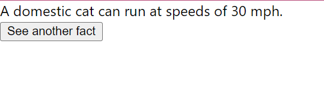

# Kitty Literature Api

A minimal React app used to fetch a fact from an api and display it on a webpage. A new fact loads when the button is clicked.

Pretty simple. Just fetching an api and everyone on the internet loves cats, right? I just made this to practice my React skills.

